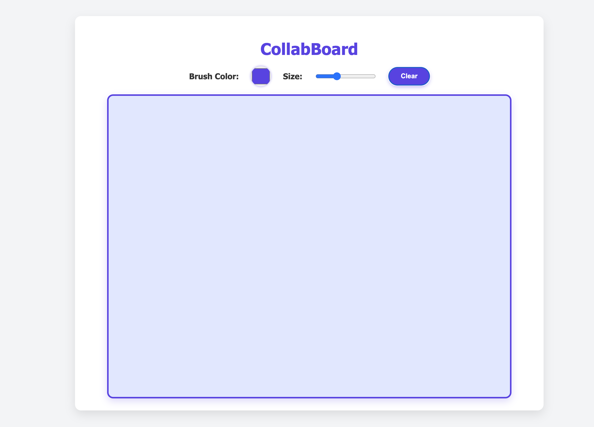

# CollabBoard - Real-time Collaborative Whiteboard



> A real-time, multi-user collaborative whiteboard app built with React, Node.js, Socket.IO, and MongoDB.  
> Draw together online with smooth syncing, customizable brush colors & sizes, and persistent boards!

---

## Table of Contents

- [Features](#features)
- [Tech Stack](#tech-stack)
- [Getting Started](#getting-started)
- [Project Structure](#project-structure)
- [Environment Variables](#environment-variables)
- [Usage](#usage)
- [API & Socket Events](#api--socket-events)
- [Contributing](#contributing)
- [License](#license)

---

## Features

- Real-time collaborative drawing with multiple users in the same room
- Brush color and size customization
- Persistent drawing board saved to MongoDB
- Clear board functionality for all users
- Responsive and modern UI with round buttons and smooth design

---

## Tech Stack

- **Frontend:** React (with functional components and hooks)
- **Backend:** Node.js + Express + Socket.IO
- **Database:** MongoDB (with Mongoose ODM)
- **Communication:** WebSocket powered by Socket.IO
- **Styling:** CSS (clean, modern design without frameworks)

---

## Getting Started

### Prerequisites

- Node.js (v16+ recommended)
- Docker & Docker Compose (optional but recommended)
- MongoDB instance (local or cloud, e.g. MongoDB Atlas)

---

### Local Setup

1. **Clone the repo**

```bash
git clone https://github.com/yourusername/collabboard.git
cd collabboard
```

2. **Configure environment variables**

Create a `.env` file in your `server` folder:

```
MONGO_URI=your_mongodb_connection_string
```

3. **Install dependencies**

For backend:

```bash
cd server
npm install
```

For frontend:

```bash
cd ../client
npm install
```

4. **Start the backend server**

```bash
npm run start
```

Server listens on: `http://localhost:5001`

5. **Start the frontend**

```bash
npm start
```

Frontend runs on: `http://localhost:3000`

### Using Docker Compose

If you want a quick setup with MongoDB included, use Docker Compose:

```bash
docker-compose up --build
```

- Backend server will be available on port `5001`
- Frontend on port `3000`
- MongoDB container on port `27017`

---

## Project Structure

```
collabboard/
│
├── client/               # React frontend
│   ├── src/
│   │   ├── App.tsx       # Main app component with canvas & socket logic
│   │   └── index.css     # Styles for the frontend
│   └── package.json
│
├── server/               # Express + Socket.IO backend
│   ├── models/
│   │   └── Board.js      # Mongoose schema for storing board actions
│   ├── index.js          # Express server & socket setup
│   └── package.json
│
├── docker-compose.yml    # Docker Compose setup for dev environment
├── .gitignore            # Ignored files and folders
└── README.md             # This file
```

---

## Environment Variables

| Variable  | Description               |
| --------- | ------------------------- |
| MONGO_URI | MongoDB connection string |

**Never commit your `.env` file or secrets to the repo! Use `.gitignore`.**

---

## Usage

1. Open the frontend in your browser (`http://localhost:3000`)
2. Start drawing on the whiteboard using your mouse
3. Select brush color and size from controls
4. Clear the board for everyone using the clear button
5. All drawings sync live with other users in the same room (default room by default)
6. Boards persist on the server and reload when users join the room

---

## API & Socket Events

| Event Name    | Direction       | Payload                                  | Description                                 |
| ------------- | --------------- | ---------------------------------------- | ------------------------------------------- |
| `join-room`   | Client → Server | `roomId: string`                         | Join a specific board room                  |
| `load-board`  | Server → Client | `actions: DrawAction[]`                  | Load saved drawing actions on join          |
| `draw`        | Client → Server | `{ roomId: string, action: DrawAction }` | Send new drawing action                     |
| `draw`        | Server → Client | `action: DrawAction`                     | Broadcast new drawing action to other users |
| `clear-board` | Client → Server | `roomId: string`                         | Request to clear the board                  |
| `clear-board` | Server → Client | `None`                                   | Notify clients to clear their boards        |

### DrawAction object shape:

```ts
type DrawAction = {
  fromX: number;
  fromY: number;
  toX: number;
  toY: number;
  color: string;
  size: number;
};
```

---

## Contributing

Feel free to open issues or submit PRs! Some ideas for improvements:

- Add user authentication & multiple rooms
- Add shape tools (circle, rectangle, text)
- Undo/redo functionality
- Save boards as images or export as PDF
- Mobile-friendly UI improvements

---

## License

MIT License © 2025 Sansika Kodithuwakku

Made with ❤️ by Sansika
